# 🚀 ML Engineer in Progress | Full-Stack Builder
### *Turning data into decisions and ideas into deployable products.*

  
  
  
  

---

## 👨‍💻 Professional Summary

Engineering student with a strong interest in **Machine Learning**, backed by solid **web development skills**. I’ve worked on building **end-to-end AI applications**, which has helped me develop a strong understanding of machine learning concepts, NLP, and front-end design.

I enjoy creating practical solutions by combining ML models with clean and interactive web interfaces. Along the way, I’ve taken part in hackathons, ideathons, and college tech events that sharpened my problem-solving ability and team collaboration.

---

## 🎓 Education & Credentials

- **Bharati Vidyapeeth College of Engineering (BVCOE), Delhi**  
  *B.Tech in Computer Science Engineering* (**2023 – 2027**)
- **Angels Public School**  
  *CBSE Class XII* (**2023**)

---

## 💼 Professional Experience

### **Machine Learning Intern — GAIL India Limited**
**July 2025 – August 2025**

- Engineered a production-ready **House Price Prediction** engine utilizing Linear, Ridge, and Lasso Regression algorithms.
- Architected robust data preprocessing pipelines for missing value handling, feature scaling, and outlier treatment.
- Trained and evaluated models on housing data and improved reliability via EDA and tuning.
- Achieved **R² > 0.73** and reduced RMSE by **10%** with optimization techniques.
- Deployed the workflow as an interactive real-time application using **Streamlit**.

---

## 🌟 Projects

### 🎬 Movie Recommendation System
**Tech:** Python, Streamlit, NumPy, Pandas, Scikit-learn  
**GitHub:** [Movie Recommendation System](https://github.com/RITESH2127)

- Built a recommendation-focused ML application with data analysis and predictive modeling workflows.
- Designed analysis pipelines using EDA + statistical methods to extract useful behavioral insights.

### 📉 Customer Churn Prediction System
**Tech:** Python, Scikit-learn, Pandas, NumPy, JS, HTML, CSS, FastAPI, Matplotlib, Seaborn  
**GitHub:** [Customer Churn Prediction System](https://github.com/RITESH2127/Customer-Churn-Prediction-System)

- Architected a classification-based ML framework (including Random Forest) to predict customer attrition.
- Addressed class imbalance and achieved **85%+ predictive accuracy** for retention strategy support.

### 🏠 House Price Prediction System
**Tech:** Python, Streamlit, NumPy, Pandas, Scikit-learn, FastAPI, Docker  
**GitHub:** [House Price Prediction Tool](https://github.com/RITESH2127/HOUSE-PRICE-PREDICTION-TOOL)

- Built an end-to-end regression ML solution using practical housing datasets.
- Performed data cleaning, feature engineering, and exploratory analysis to identify key pricing factors.
- Trained Linear/Ridge/Lasso models and deployed real-time predictions through Streamlit.

---

## 🕹️ Auto-Play Mini Game (No Input Needed)

> A self-running animated developer game-card that plays automatically in your README.

  

### How it works
- Fully animated SVG (code-rain, terminal outputs, progress bars).
- Runs automatically on render — **no user input required**.
- Adds visual personality and makes the profile more attractive.

---

## 🧰 Technical Skills

- **Programming Languages:** Python, SQL, C++, C, Java
- **AI & Machine Learning:** TensorFlow, Computer Vision, NLP, Scikit-learn, NumPy
- **Data Science & Analytics:** Pandas, NumPy, Matplotlib, Excel
- **Databases & Stores:** PostgreSQL (Relational), MongoDB
- **Developer Tools & Cloud:** Git/GitHub, Docker, Streamlit, Google Cloud (Service Accounts), REST APIs
- **Core Concepts:** DSA, OOP, Software Engineering

---

## 🏆 Achievements & Extracurriculars

- 🥇 **1st Place** — *Innovate and Automate* (Flagship Hackathon), ISA Delhi (Hardware)
- 🏅 **4th Place + Special Mention** — Agentic AI Hackathon (Flagship Event), IEEE MAIT
- 🥈 Runner-up in **3 hackathons**
- 💡 Participated in **10+ hackathons / ideathons**
- 👥 **Administration Executive**, DSC BVCOE *(Sep 2024 – Present)*
- 🎭 **Administration Executive**, Venuva BVCOE *(Sep 2024 – Apr 2025)*

---

## 🤝 Let’s Connect

I’m actively looking for **2026 internships and placement opportunities** in Software Engineering and Machine Learning.

- GitHub: [RITESH2127](https://github.com/RITESH2127)
- LinkedIn: [Ritesh Kumar](https://www.linkedin.com/in/ritesh-kumar-173154355)
- Email: [riteshkumarnew369@gmail.com](mailto:riteshkumarnew369@gmail.com)

### ⭐ Thank you for visiting my profile!
*If you like my work, consider following and starring the repositories.*

