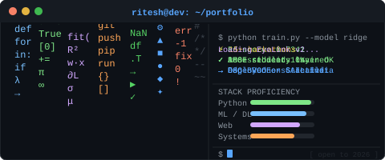

  

  **B.Tech CSE (AI/ML) @ Bharati Vidyapeeth College of Engineering**

  
  
  
  

  *I specialize in designing end-to-end AI pipelines—from robust data preprocessing and model architecture to deploying scalable, transparent web applications.*

---

### 📈 GitHub Analytics

  
  

---

### 🧰 Technical Arsenal

  

 

* **Languages:** Python, C++, Java, SQL
* **AI & Machine Learning:** TensorFlow, Keras, Scikit-Learn, ResNet, Random Forest, LIME, Grad-CAM (XAI)
* **Data Science:** Pandas, NumPy, Matplotlib, Seaborn, EDA, Feature Engineering
* **Web & Backend:** FastAPI, Flask, Streamlit, REST APIs
* **Cloud & Tools:** Google Cloud Platform (GCP), Git, GitHub

---

### 💼 Engineering Experience

**Machine Learning Intern | GAIL India Limited** *(Jul 2025 – Aug 2025)*  
- Engineered a production-ready house price prediction system using Linear, Ridge, and Lasso Regression, achieving an $R^2 > 0.73$ and reducing RMSE by 10% via advanced hyperparameter tuning.
- Built robust data preprocessing pipelines to handle missing value imputation, feature scaling, and outlier detection, dramatically improving model stability on the Boston Housing dataset.
- Deployed the machine learning workflow as a real-time Streamlit web application, enabling interactive predictions with zero infrastructure overhead.

---

### 🔬 Featured Work & Leadership

<table bordercolor="#30363d">
  <tr>
    <td width="50%" valign="top">
      <h4>🧠 ADHD Detection System</h4>
      
An AI diagnostic system leveraging deep learning (ResNet) to analyze multimodal neural signals (EEG and fMRI). Integrated <strong>Explainable AI (XAI)</strong> frameworks like Grad-CAM and LIME for diagnostic transparency.

      
<b>Stack:</b> Python, ResNet, Grad-CAM, LIME, Flask

    </td>
    <td width="50%" valign="top">
      <h4>🎬 NLP Movie Recommendation Engine</h4>
      
Content-based NLP recommendation engine utilizing TF-IDF vectorization and Cosine Similarity to process metadata. Features a real-time Streamlit interface integrated with the TMDB API to fetch dynamic movie data.

      
<b>Stack:</b> Python, NLP, TF-IDF, Streamlit, TMDB API

    </td>
  </tr>
  <tr>
    <td width="50%" valign="top">
      <h4>📊 Customer Churn Prediction</h4>
      
Classification-based ML framework predicting customer attrition with <strong>85%+ accuracy</strong>. Mitigated severe class imbalance using SMOTE and deployed a FastAPI backend connected to dynamic dashboards.

      
<b>Stack:</b> Python, Random Forest, SMOTE, FastAPI

    </td>
    <td width="50%" valign="top">
      <h4>🏆 Hackathons & Community</h4>
      <ul>
        <li><b>Admin Exec @ GDSC BVCOE:</b> Coordinated tech workshops & events for a 200+ student developer community.</li>
        <li><b>1st Place:</b> ISA Delhi Automation Day Hackathon</li>
        <li><b>4th Place:</b> Agentic AI Hackathon (IEEE MAIT)</li>
        <li><b>Runner-Up:</b> 3 additional hackathons (Out of 10+)</li>
      </ul>
    </td>
  </tr>
</table>

---

### 🐍 Contribution Graph

  <picture>
    <source media="(prefers-color-scheme: dark)" srcset="game.svg">
    <source media="(prefers-color-scheme: light)" srcset="game.svg">
    
  </picture>

---

  
  

