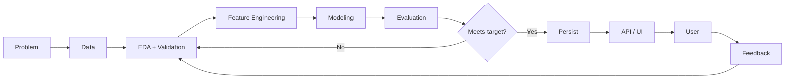

<!-- ═══════════════════════════════════════════════════════════════════════
     RITESH KUMAR — GitHub Profile README
     Designed as a living engineering portfolio.
════════════════════════════════════════════════════════════════════════ -->

<div align="center">

<a href="https://github.com/RITESH2127">
  
</a>

<br>

# RITESH KUMAR

### AI • MACHINE LEARNING • DATA • SOFTWARE ENGINEERING

<p>
  <em>Building intelligent systems from raw data to usable software.</em>
</p>

<br>

<a href="./PORTFOLIO.html">
  
</a>
<a href="./Ritesh_Kumar_Resume_.pdf">
  
</a>
<a href="https://www.linkedin.com/in/ritesh-kumar-173154355">
  
</a>
<a href="mailto:riteshkumarnew369@gmail.com">
  
</a>

<br><br>


<br>


</div>

---

## ◈ WHO I AM

I’m **Ritesh Kumar**, a Computer Science Engineering student focused on the intersection of **Machine Learning, Artificial Intelligence, Data Science, and Software Engineering**.

I enjoy the full engineering loop:

```text
Problem
  ↓
Data
  ↓
Understanding
  ↓
Features
  ↓
Model
  ↓
Evaluation
  ↓
API / Application
  ↓
Deployment
  ↓
Iteration
```

My goal is simple:

> **Turn ideas into systems that can be understood, tested, used, and improved.**

---

## ◈ AT A GLANCE

<table>
<tr>
<td width="50%" valign="top">

### CURRENT FOCUS

- Machine Learning
- Deep Learning
- Explainable AI
- Data Science
- Backend & APIs
- DSA + SQL

</td>
<td width="50%" valign="top">

### ENGINEERING MINDSET

- Reproducible workflows
- Measured model performance
- Clean interfaces
- Practical deployment
- Clear documentation
- Continuous iteration

</td>
</tr>
</table>

---

## ◈ TECHNOLOGY CONSTELLATION

### Languages

<p>
  
</p>

### AI / ML

<p>
  
</p>

**Core:** NumPy · Pandas · Scikit-learn · Matplotlib · Seaborn · Keras  
**Machine Learning:** Regression · Classification · Clustering · Ensemble Learning · Feature Engineering · Model Selection  
**Deep Learning:** Neural Networks · CNNs · Sequence Modeling · Transfer Learning  
**Explainability:** SHAP · Grad-CAM · LIME  
**NLP / Recommendation:** TF-IDF · Cosine Similarity · Text Features · Recommendation Pipelines

### Application / Engineering

<p>
  
</p>

**Application:** Streamlit · Flask · FastAPI · REST APIs  
**Engineering:** Git · GitHub · Docker · CI/CD · Joblib · Testing  
**Cloud:** Google Cloud Platform

---

# ◈ EXPERIENCE

## Machine Learning Engineer Intern — Swift Volt Ventures

**Jun 2026 — Aug 2026**

Worked on an end-to-end **Battery Intelligence Platform** focused on EV battery health, degradation and Remaining Useful Life (RUL).

### Core work

- Battery telemetry preprocessing and degradation-oriented feature engineering
- State of Health (SoH) and Remaining Useful Life (RUL) prediction workflows
- Model comparison using Random Forest, XGBoost, Gradient Boosting and LightGBM
- Cross-validation and regression-based evaluation
- SHAP-based global and local explainability
- Streamlit dashboards for prediction, analytics, explainability and fleet monitoring
- Joblib-based model persistence and reproducible metadata
- Docker, Docker Compose, GitHub Actions CI and smoke testing

**Project:** [Battery Intelligence Platform →](https://github.com/RITESH2127/-BATTERY-INTELLIGENCE-PLAYTFORM-2026-INTERSHIP-SWIFT-VOLT-VENTURES-)

---

## Machine Learning Intern — GAIL (India) Limited

**Jul 2025 — Aug 2025 · Delhi**

Built the **Boston House Price Prediction Tool** as an end-to-end regression application.

### Core work

- Data preprocessing and exploratory analysis
- Feature engineering and scaling
- Linear, Ridge, Lasso and Random Forest regression
- R² and RMSE model evaluation
- Model comparison and selection
- Joblib model persistence
- Interactive Streamlit inference
- Docker and GitHub Actions based engineering workflow

**Project:** [House Price Prediction Tool →](https://github.com/RITESH2127/HOUSE-PRICE-PREDICTION-TOOL)

---

# ◈ SELECTED BUILDS

<div align="center">

### 🧠 DEEP LEARNING + XAI

</div>

### ADHD Detection Mini Project

A deep-learning project exploring ADHD detection from neurological data with an emphasis on model learning and interpretability.

**Stack:** EEG · fMRI · ResNet · Deep Learning · Grad-CAM · LIME

[Open Repository →](https://github.com/RITESH2127/ADHD-DETECTION-MINI-PROJECT-)

---

<div align="center">

### 🎬 NLP + RECOMMENDATION

</div>

### Movie Recommendation System

A recommendation pipeline using text representation and similarity-driven retrieval to generate movie recommendations.

**Stack:** NLP · TF-IDF · Cosine Similarity · Recommendation Systems · Streamlit

[Open Repository →](https://github.com/RITESH2127/MOVIE-RECOMMENDATION-SYSTEM)

---

<div align="center">

### 📊 PREDICTIVE ANALYTICS

</div>

### Customer Churn Prediction System

A machine-learning classification system for churn analysis with an application layer for serving predictions.

**Stack:** Classification · Random Forest · SMOTE · FastAPI

[Open Repository →](https://github.com/RITESH2127/Customer-Churn-Prediction-System)

---

<div align="center">

### 👁️ COMPUTER VISION

</div>

### Edge Vision

A computer-vision oriented project focused on practical visual intelligence and application development.

**Focus:** Computer Vision · AI · Application Development

[Open Repository →](https://github.com/RITESH2127/EDGE-VISION)

---

<div align="center">

### ⚡ RAPID PROTOTYPING

</div>

### Agentic AI & Hackathon Builds

I use hackathons as a fast feedback loop for turning ideas into prototypes — experimenting with AI agents, automation, interfaces and product concepts.

[Agentic AI Hackathon →](https://github.com/RITESH2127/AGENTIC-AI-HACKATHON-)  
[Interactive Web Experience Challenge →](https://github.com/RITESH2127/The-Interactive-Web-Experience-Challenge-hackathon)  
[Emotion-Aware Hackathon →](https://github.com/RITESH2127/EMOTION-AWARE-HACKATHON)

---

# ◈ THE ENGINEERING PATTERN

A large part of my work follows the same architecture:


```mermaid
flowchart LR
    A["Problem"] --> B["Data"]
    B --> C["EDA + Validation"]
    C --> D["Feature Engineering"]
    D --> E["Modeling"]
    E --> F["Evaluation"]
    F --> G{"Meets target?"}
    G -- "No" --> C
    G -- "Yes" --> H["Persist"]
    H --> I["API / UI"]
    I --> J["User"]
    J --> K["Feedback"]
    K --> C
```

### What matters to me

| Layer | Question |
|:--|:--|
| **Problem** | What are we actually solving? |
| **Data** | Is the input trustworthy and useful? |
| **Model** | Does it learn the intended signal? |
| **Evaluation** | Does the evidence support the result? |
| **Engineering** | Can someone else run and reuse it? |
| **Interface** | Can a real user interact with it? |
| **Iteration** | What can be improved next? |

---

# ◈ PROBLEM SOLVING

### LeetCode + SQL

My [LEETCODE repository](https://github.com/RITESH2127/LEETCODE) is a growing record of algorithmic and SQL practice.

It currently contains **48 solved problems** tracked across Easy, Medium and Hard difficulty levels.

### Covered patterns

```text
Arrays ── Hashing ── Two Pointers ── Strings
    │
    ├── Linked Lists
    ├── Recursion
    ├── Backtracking
    ├── Greedy
    └── Dynamic Programming

SQL ── Filtering ── JOINs ── Aggregation
  └── Subqueries ── Conditional Logic ── Analytics
```

[Explore the problem-solving repository →](https://github.com/RITESH2127/LEETCODE)

---

# ◈ COMMUNITY + COLLABORATION

I’ve also explored the developer community through **Google Developer Student Club (GDSC), BVCOE**, hackathons, collaborative builds and technical project work.

That experience has shaped an important lesson:

> **Good engineering is not only about writing code — it is also about communicating ideas, working with people, and shipping under constraints.**

---

# ◈ WHAT I’M BUILDING TOWARD

<table>
<tr>
<td align="center" width="25%">
<h3>01</h3>
<b>ML</b><br>
<sub>Stronger fundamentals, evaluation & deployment</sub>
</td>
<td align="center" width="25%">
<h3>02</h3>
<b>Deep Learning</b><br>
<sub>Representation learning & modern architectures</sub>
</td>
<td align="center" width="25%">
<h3>03</h3>
<b>GenAI / Agents</b><br>
<sub>Intelligent applications & workflows</sub>
</td>
<td align="center" width="25%">
<h3>04</h3>
<b>Software</b><br>
<sub>DSA, APIs, systems & production thinking</sub>
</td>
</tr>
</table>

---

# ◈ PROFILE TELEMETRY

<div align="center">

<picture>
  <source media="(prefers-color-scheme: dark)" srcset="./profile/stats-dark.svg">
  <source media="(prefers-color-scheme: light)" srcset="./profile/stats-light.svg">
  
</picture>

<picture>
  <source media="(prefers-color-scheme: dark)" srcset="./profile/top-langs-dark.svg">
  <source media="(prefers-color-scheme: light)" srcset="./profile/top-langs-light.svg">
  
</picture>

<br>

<picture>
  <source media="(prefers-color-scheme: dark)" srcset="./profile/contribution-dark.svg">
  <source media="(prefers-color-scheme: light)" srcset="./profile/contribution-light.svg">
  
</picture>

<sub>Repository-backed profile assets · automatically refreshed through GitHub Actions</sub>

</div>

---

# ◈ FEATURED REPOSITORIES

| Project | What it demonstrates |
|:--|:--|
| [Battery Intelligence Platform](https://github.com/RITESH2127/-BATTERY-INTELLIGENCE-PLAYTFORM-2026-INTERSHIP-SWIFT-VOLT-VENTURES-) | ML · Battery Prognostics · XAI · Dashboards · Docker |
| [House Price Prediction Tool](https://github.com/RITESH2127/HOUSE-PRICE-PREDICTION-TOOL) | Regression · Evaluation · Streamlit · Deployment |
| [ADHD Detection](https://github.com/RITESH2127/ADHD-DETECTION-MINI-PROJECT-) | Deep Learning · EEG/fMRI · Explainability |
| [Movie Recommendation System](https://github.com/RITESH2127/MOVIE-RECOMMENDATION-SYSTEM) | NLP · TF-IDF · Similarity · Recommendation |
| [Customer Churn Prediction](https://github.com/RITESH2127/Customer-Churn-Prediction-System) | Classification · SMOTE · FastAPI |
| [Edge Vision](https://github.com/RITESH2127/EDGE-VISION) | Computer Vision · AI Application |
| [Agentic AI Hackathon](https://github.com/RITESH2127/AGENTIC-AI-HACKATHON-) | Agents · Prototyping · Experimentation |
| [Document Assistant & Quiz Gen](https://github.com/RITESH2127/Document-Assistant-Quiz-Gen) | RAG-style workflow · Embeddings · FAISS · Quiz Generation |
| [Portfolio](https://github.com/RITESH2127/PORTFOLIO) | Interactive Web Engineering |
| [LeetCode](https://github.com/RITESH2127/LEETCODE) | DSA · SQL · Interview Practice |

---

# ◈ MY WORKING PRINCIPLES

<table>
<tr>
<td align="center"><b>01</b><br>Understand before optimizing.</td>
<td align="center"><b>02</b><br>Measure before claiming.</td>
<td align="center"><b>03</b><br>Build beyond the notebook.</td>
<td align="center"><b>04</b><br>Document what you ship.</td>
</tr>
</table>

> **Learn deeply. Build relentlessly. Ship thoughtfully.**

---

# ◈ LET’S CONNECT

I’m interested in opportunities and collaborations around **AI/ML, data science, intelligent applications, software engineering, developer tools, and technically ambitious projects**.

<div align="center">

<a href="https://github.com/RITESH2127">
  
</a>
<a href="https://www.linkedin.com/in/ritesh-kumar-173154355">
  
</a>
<a href="mailto:riteshkumarnew369@gmail.com">
  
</a>

<br><br>


<br><br>

<sub>© 2026 Ritesh Kumar · Built as a living engineering profile.</sub>

</div>

<!--
  The best profile is never finished.
  It keeps changing as the work gets better.
-->
