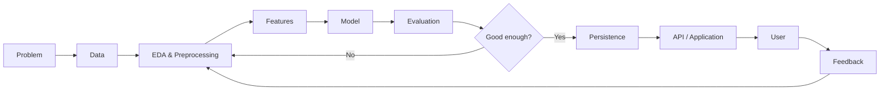

<div align="center">

<picture>
  <source media="(prefers-color-scheme: dark)" srcset="./assets/hero.svg">
  <source media="(prefers-color-scheme: light)" srcset="./assets/hero.svg">
  
</picture>

<br>

<a href="PORTFOLIO.html"></a>
<a href="Ritesh_Kumar_Resume_.pdf"></a>
<a href="https://www.linkedin.com/in/ritesh-kumar-173154355"></a>
<a href="mailto:riteshkumarnew369@gmail.com"></a>

<br><br>


<p><strong>B.Tech Computer Science Engineering</strong> · Bharati Vidyapeeth's College of Engineering, Delhi</p>

</div>

---

## ◈ The Short Version

> **I build intelligent software systems — not just notebooks.**

I'm **Ritesh Kumar**, a Computer Science Engineering student working at the intersection of **Artificial Intelligence, Machine Learning, Data Science, and Software Engineering**.

I like the part of engineering where an idea becomes a working system:

**Problem → Data → Model → Evaluation → API → Interface → Deployment**

My repositories reflect that mindset: practical ML applications, deep-learning experiments, recommendation systems, computer vision, web engineering, hackathon prototypes, and continuous problem-solving.

---

## ◈ What I Build

<table>
<tr>
<td width="25%" align="center">
<h3>01</h3>
<strong>AI / ML</strong><br>
<sub>Models that learn from data</sub>
</td>
<td width="25%" align="center">
<h3>02</h3>
<strong>Data</strong><br>
<sub>Pipelines, features & insights</sub>
</td>
<td width="25%" align="center">
<h3>03</h3>
<strong>Software</strong><br>
<sub>APIs, interfaces & systems</sub>
</td>
<td width="25%" align="center">
<h3>04</h3>
<strong>Deployment</strong><br>
<sub>Turning experiments into products</sub>
</td>
</tr>
</table>

### My Engineering Loop

```text
┌──────────────┐
│  Understand  │  Define the problem & success criteria
└──────┬───────┘
       ↓
┌──────────────┐
│    Explore   │  Clean, analyze & understand the data
└──────┬───────┘
       ↓
┌──────────────┐
│    Model     │  Train, compare, tune & validate
└──────┬───────┘
       ↓
┌──────────────┐
│   Engineer   │  APIs, UI, persistence & reliability
└──────┬───────┘
       ↓
┌──────────────┐
│     Ship     │  Deploy, document & iterate
└──────────────┘
```

---

## ◈ Technical Arsenal

### Languages

<p>

</p>

### AI / Data

<p>

</p>

**Core:** Scikit-learn · Pandas · NumPy · Matplotlib · Seaborn · Keras  
**ML:** Regression · Classification · Clustering · Ensemble Methods · Feature Engineering · Model Selection  
**Deep Learning:** Neural Networks · CNNs · Transfer Learning · Sequence Modeling  
**XAI:** Grad-CAM · LIME · Explainability workflows  
**NLP:** TF-IDF · Text similarity · Recommendation systems

### Backend / Application / Cloud

<p>

</p>

**Application:** Flask · FastAPI · Streamlit · REST APIs  
**Engineering:** Git · GitHub · API integration · Model persistence  
**Cloud:** Google Cloud Platform

---

## ◈ Experience

### Machine Learning Intern · GAIL (India) Limited
**Jul 2025 — Aug 2025 · Delhi**

Worked on an end-to-end **House Price Prediction** application.

**What I worked on**
- Data preprocessing and exploratory analysis
- Feature engineering and feature scaling
- Linear, Ridge and Lasso Regression
- R² and RMSE based model evaluation
- Hyperparameter tuning and model comparison
- Model persistence with Joblib
- Interactive prediction interface with Streamlit

**The engineering takeaway:** a useful ML project is more than a trained model — it is the complete path from raw data to a usable prediction system.

→ [View the project](https://github.com/RITESH2127/HOUSE-PRICE-PREDICTION-TOOL)

---

# ◈ Selected Work

<div align="center">

### 🧠 AI / RESEARCH

</div>

### ADHD Detection Mini Project
A deep-learning oriented project exploring ADHD detection from neurological data, with a focus on model learning and interpretability.

**Focus:** EEG · fMRI · Deep Learning · ResNet · Grad-CAM · LIME

→ [Open repository](https://github.com/RITESH2127/ADHD-DETECTION-MINI-PROJECT-)

---

<div align="center">

### 📈 MACHINE LEARNING

</div>

### House Price Prediction Tool
An end-to-end regression workflow comparing multiple models and exposing the final prediction pipeline through an interactive application.

**Focus:** Regression · EDA · Feature Engineering · Model Evaluation · Streamlit

→ [Open repository](https://github.com/RITESH2127/HOUSE-PRICE-PREDICTION-TOOL)

---

<div align="center">

### 🎬 RECOMMENDATION SYSTEMS

</div>

### Movie Recommendation System
A recommendation engine built around movie metadata, text representation and similarity-based recommendations.

**Focus:** NLP · TF-IDF · Cosine Similarity · Recommendation Systems · Streamlit

→ [Open repository](https://github.com/RITESH2127/MOVIE-RECOMMENDATION-SYSTEM)

---

<div align="center">

### 📊 PREDICTIVE ANALYTICS

</div>

### Customer Churn Prediction System
A classification-oriented system designed to identify customer churn, with attention to class imbalance and application-layer integration.

**Focus:** Classification · Random Forest · SMOTE · FastAPI

→ [Open repository](https://github.com/RITESH2127/Customer-Churn-Prediction-System)

---

<div align="center">

### 👁️ COMPUTER VISION

</div>

### Edge Vision
A computer-vision focused project exploring practical visual intelligence and AI application development.

**Focus:** Computer Vision · AI · Application Development

→ [Open repository](https://github.com/RITESH2127/EDGE-VISION)

---

<div align="center">

### ⚡ RAPID PROTOTYPING

</div>

### Agentic AI & Hackathon Projects
Hackathons are my laboratory for moving quickly from an idea to a prototype — experimenting with AI agents, automation, interfaces and product concepts.

→ [Agentic AI Hackathon](https://github.com/RITESH2127/AGENTIC-AI-HACKATHON-)  
→ [Interactive Web Experience Challenge](https://github.com/RITESH2127/The-Interactive-Web-Experience-Challenge-hackathon)

---

## ◈ System Architecture

The way I think about AI projects:


```mermaid
flowchart LR
    A[Problem] --> B[Data]
    B --> C[EDA & Preprocessing]
    C --> D[Features]
    D --> E[Model]
    E --> F[Evaluation]
    F --> G{Good enough?}
    G -- No --> C
    G -- Yes --> H[Persistence]
    H --> I[API / Application]
    I --> J[User]
    J --> K[Feedback]
    K --> C
```

The goal is not simply **high training performance**.

The goal is a system that can be **understood, evaluated, used, improved, and eventually deployed**.

---

## ◈ Beyond the Code

**Developer Community**

Experience with **Google Developer Student Club (GDSC), BVCOE**, including coordination and technical community activities.

**Hackathons**

I use hackathons to practice rapid problem decomposition, prototyping, teamwork, presentation, and shipping under constraints.

**Problem Solving**

My `LEETCODE` repository tracks ongoing practice across programming, SQL, algorithms and data structures.

→ [Open LeetCode repository](https://github.com/RITESH2127/LEETCODE)

---

## ◈ Currently Building

<table>
<tr>
<td>

**01 · Machine Learning**

Strengthening fundamentals, model selection, evaluation and practical deployment.

</td>
<td>

**02 · Deep Learning**

Going deeper into neural architectures, representation learning and explainability.

</td>
</tr>
<tr>
<td>

**03 · Generative / Agentic AI**

Exploring modern AI application patterns and intelligent workflows.

</td>
<td>

**04 · Software Engineering**

Improving DSA, APIs, system design, code quality and production thinking.

</td>
</tr>
</table>

---

## ◈ GitHub Telemetry

<p align="center">
  <picture>
    <source media="(prefers-color-scheme: dark)" srcset="./profile/stats-dark.svg">
    <source media="(prefers-color-scheme: light)" srcset="./profile/stats-light.svg">
    
  </picture>
  <picture>
    <source media="(prefers-color-scheme: dark)" srcset="./profile/top-langs-dark.svg">
    <source media="(prefers-color-scheme: light)" srcset="./profile/top-langs-light.svg">
    
  </picture>
</p>

> **Live data, generated locally by GitHub Actions.**  
> This avoids depending on a public stats endpoint at page-load time.

---

## ◈ Contribution Matrix

<div align="center">
  <picture>
    <source media="(prefers-color-scheme: dark)" srcset="./dist/snake-dark.svg">
    <source media="(prefers-color-scheme: light)" srcset="./dist/snake.svg">
    
  </picture>
</div>

<p align="center">
  <sub>My GitHub contribution activity visualized as a generated contribution map.</sub>
</p>

---

## ◈ Repository Map

| Repository | Signal |
|:--|:--|
| [ADHD-DETECTION-MINI-PROJECT-](https://github.com/RITESH2127/ADHD-DETECTION-MINI-PROJECT-) | Deep Learning · XAI · Research |
| [HOUSE-PRICE-PREDICTION-TOOL](https://github.com/RITESH2127/HOUSE-PRICE-PREDICTION-TOOL) | ML · Regression · Deployment |
| [MOVIE-RECOMMENDATION-SYSTEM](https://github.com/RITESH2127/MOVIE-RECOMMENDATION-SYSTEM) | NLP · Recommendation |
| [Customer-Churn-Prediction-System](https://github.com/RITESH2127/Customer-Churn-Prediction-System) | Classification · APIs |
| [EDGE-VISION](https://github.com/RITESH2127/EDGE-VISION) | Computer Vision |
| [AGENTIC-AI-HACKATHON-](https://github.com/RITESH2127/AGENTIC-AI-HACKATHON-) | Agents · Rapid Prototyping |
| [PORTFOLIO](https://github.com/RITESH2127/PORTFOLIO) | Web Engineering |
| [LEETCODE](https://github.com/RITESH2127/LEETCODE) | DSA · SQL · Problem Solving |

---

## ◈ A Few Principles

<table>
<tr>
<td align="center"><strong>01</strong><br>Understand before optimizing.</td>
<td align="center"><strong>02</strong><br>Measure before claiming.</td>
<td align="center"><strong>03</strong><br>Explain what the model does.</td>
<td align="center"><strong>04</strong><br>Build beyond the notebook.</td>
</tr>
</table>

> **Learn deeply. Build relentlessly. Ship thoughtfully.**

---

## ◈ Let's Build Something

If you're working on **AI/ML, data science, software engineering, developer tools, intelligent applications, or an interesting technical problem**, I'd be happy to connect.

<div align="center">

<a href="https://github.com/RITESH2127"></a>
<a href="https://www.linkedin.com/in/ritesh-kumar-173154355"></a>
<a href="mailto:riteshkumarnew369@gmail.com"></a>

<br><br>


<br><br>

<sub>Designed as a living technical profile — evolving with every project, experiment and lesson.</sub>

</div>
