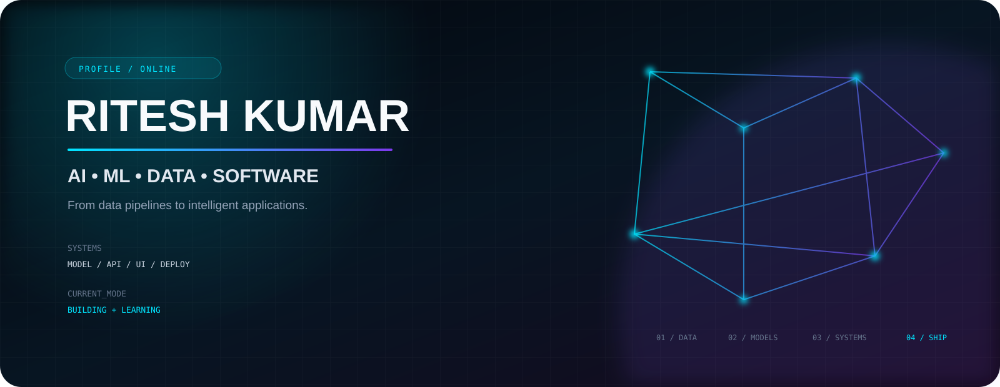
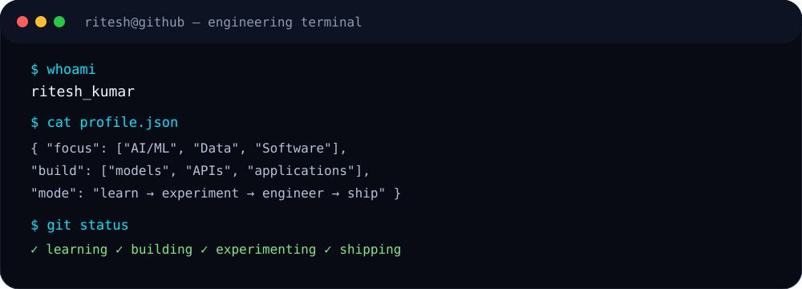
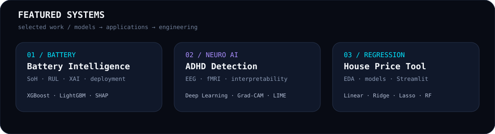
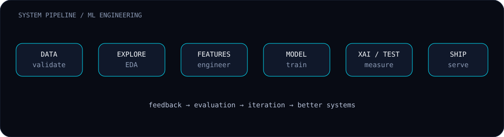

<!-- RITESH KUMAR — ENGINEERING PROFILE -->

  

  

---

### 01 — THE PERSON BEHIND THE REPOSITORIES

I’m **Ritesh Kumar**, a Computer Science Engineering student interested in building practical systems at the intersection of **Artificial Intelligence, Machine Learning, Data Science and Software Engineering**.

I don't want my projects to stop at *“the model trained successfully.”*

I like taking an idea through the entire chain:

**PROBLEM** → **DATA** → **MODEL** → **EVALUATION** → **APPLICATION** → **DEPLOYMENT**

> **The objective is not to make a notebook look impressive. The objective is to make the system useful.**

 

---

### 02 — ENGINEERING DNA

<table>
<tr>
<td align="center" width="25%"><b>01</b> Understand Define the real problem.</td>
<td align="center" width="25%"><b>02</b> Measure Let evidence guide decisions.</td>
<td align="center" width="25%"><b>03</b> Engineer Turn experiments into systems.</td>
<td align="center" width="25%"><b>04</b> Ship Make the work usable.</td>
</tr>
</table>

---

### 03 — THE STACK

<table>
<tr>
<td width="50%" valign="top">

#### LANGUAGES

**Python** · **C++** · **Java** · **SQL**

</td>
<td width="50%" valign="top">

#### AI / ML

Scikit-learn · Pandas · NumPy · Keras · SHAP · Grad-CAM · LIME

</td>
</tr>
<tr>
<td valign="top">

#### APPLICATIONS

REST APIs · Interactive ML Apps · Model Serving

</td>
<td valign="top">

#### ENGINEERING

Git · GitHub Actions · Docker · Testing · CI/CD

</td>
</tr>
</table>

**Machine Learning:** Regression · Classification · Clustering · Ensemble Methods · Feature Engineering · Model Selection  
**Deep Learning:** Neural Networks · CNNs · Sequence Modeling · Transfer Learning  
**NLP / Recommendation:** TF-IDF · Cosine Similarity · Text Features · Recommendation Pipelines

---

### 04 — EXPERIENCE THAT MADE IT REAL

<table>
<tr>
<td width="18%" align="center"><h3>2026</h3>JUN — AUG</td>
<td>

## Machine Learning Engineer Intern
### Swift Volt Ventures

**Battery Intelligence Platform**

Built around EV battery health, degradation and Remaining Useful Life (RUL).

**Worked with:** Random Forest · XGBoost · Gradient Boosting · LightGBM · SHAP · Streamlit · Joblib · Docker · GitHub Actions

**Engineering focus:** telemetry preprocessing → degradation features → prediction → explainability → dashboards → CI.

**[Explore the project →](https://github.com/RITESH2127/-BATTERY-INTELLIGENCE-PLAYTFORM-2026-INTERSHIP-SWIFT-VOLT-VENTURES-)**

</td>
</tr>
<tr>
<td align="center"><h3>2025</h3>JUL — AUG</td>
<td>

## Machine Learning Intern
### GAIL (India) Limited · Delhi

**Boston House Price Prediction Tool**

Built an end-to-end regression application covering preprocessing, EDA, model comparison, evaluation, persistence and Streamlit deployment.

**Worked with:** Linear Regression · Ridge · Lasso · Random Forest · Scikit-learn · Joblib · Streamlit · Docker · GitHub Actions

**[Explore the project →](https://github.com/RITESH2127/HOUSE-PRICE-PREDICTION-TOOL)**

</td>
</tr>
</table>

---

### 05 — THE PROJECT LAB

<table>
<tr>
<td width="50%" valign="top">

## 🧠 ADHD Detection

Deep-learning exploration of ADHD detection from neurological data with an emphasis on interpretability.

**EEG · fMRI · ResNet · Grad-CAM · LIME**

[Open repository →](https://github.com/RITESH2127/ADHD-DETECTION-MINI-PROJECT-)

</td>
<td width="50%" valign="top">

## 🔋 Battery Intelligence

End-to-end battery prognostics and explainable ML platform for SoH/RUL workflows.

**XGBoost · LightGBM · SHAP · Streamlit · Docker**

[Open repository →](https://github.com/RITESH2127/-BATTERY-INTELLIGENCE-PLAYTFORM-2026-INTERSHIP-SWIFT-VOLT-VENTURES-)

</td>
</tr>
<tr>
<td valign="top">

## 🎬 Movie Recommendation

Text-driven recommendation workflow based on feature representation and similarity.

**NLP · TF-IDF · Cosine Similarity · Streamlit**

[Open repository →](https://github.com/RITESH2127/MOVIE-RECOMMENDATION-SYSTEM)

</td>
<td valign="top">

## 📊 Customer Churn

Classification system designed around churn prediction and an application/API layer.

**Random Forest · SMOTE · FastAPI**

[Open repository →](https://github.com/RITESH2127/Customer-Churn-Prediction-System)

</td>
</tr>
<tr>
<td valign="top">

## 👁️ Edge Vision

Computer-vision oriented AI application work.

**Computer Vision · AI · Application Development**

[Open repository →](https://github.com/RITESH2127/EDGE-VISION)

</td>
<td valign="top">

## ⚡ Hackathon Lab

Rapid prototypes exploring agentic AI, emotion-aware systems and interactive web experiences.

**Agents · AI · Prototyping · Product Thinking**

[Agentic AI](https://github.com/RITESH2127/AGENTIC-AI-HACKATHON-) · [Emotion-Aware](https://github.com/RITESH2127/EMOTION-AWARE-HACKATHON) · [Interactive Web](https://github.com/RITESH2127/The-Interactive-Web-Experience-Challenge-hackathon)

</td>
</tr>
</table>

---

### 06 — HOW I THINK ABOUT AN ML SYSTEM

~~~mermaid
flowchart LR
    P["01 / PROBLEM"] --> D["02 / DATA"]
    D --> E["03 / EXPLORE"]
    E --> F["04 / FEATURES"]
    F --> M["05 / MODEL"]
    M --> V["06 / VALIDATE"]
    V --> Q{"07 / READY?"}
    Q -- "iterate" --> E
    Q -- "yes" --> S["08 / SHIP"]
    S --> U["09 / USER"]
    U --> R["10 / FEEDBACK"]
    R --> E
~~~

| DATA | MODEL | XAI | SOFTWARE |
|:--:|:--:|:--:|:--:|
| Validate before trusting. | Compare before choosing. | Explain before claiming. | Package before shipping. |

---

### 07 — PROBLEM SOLVING MODE

My [LeetCode repository](https://github.com/RITESH2127/LEETCODE) is where I turn interview preparation into a long-term engineering habit.

**Algorithmic and SQL problems** are tracked as an ongoing interview-preparation practice.

~~~text
                    PROBLEM
                       │
             ┌─────────┴─────────┐
             ▼                   ▼
        ALGORITHMS               SQL
             │                   │
      Arrays / Hashing      Filtering / JOINs
      Two Pointers          Aggregation
      Strings               Subqueries
      Linked Lists           Conditional Logic
      Recursion              Analytics
      Backtracking
      Greedy / DP
~~~

**Target:** understand the pattern, write the simplest correct solution, analyze complexity, then improve it.

[Enter the problem-solving repository →](https://github.com/RITESH2127/LEETCODE)

---

### 08 — PROFILE TELEMETRY

<picture>
<source media="(prefers-color-scheme: dark)" srcset="./profile/stats-dark.svg">
<source media="(prefers-color-scheme: light)" srcset="./profile/stats-light.svg">

</picture>
<picture>
<source media="(prefers-color-scheme: dark)" srcset="./profile/top-langs-dark.svg">
<source media="(prefers-color-scheme: light)" srcset="./profile/top-langs-light.svg">

</picture>

 

<picture>
<source media="(prefers-color-scheme: dark)" srcset="./profile/contribution-dark.svg">
<source media="(prefers-color-scheme: light)" srcset="./profile/contribution-light.svg">

</picture>

Generated profile assets · automatically refreshed through GitHub Actions

---

### 09 — THE REPOSITORY MAP

| Repository | Signal |
|:--|:--|
| [Battery Intelligence Platform](https://github.com/RITESH2127/-BATTERY-INTELLIGENCE-PLAYTFORM-2026-INTERSHIP-SWIFT-VOLT-VENTURES-) | 🔋 Battery ML · XAI · Deployment |
| [House Price Prediction](https://github.com/RITESH2127/HOUSE-PRICE-PREDICTION-TOOL) | 🏠 Regression · Streamlit · CI |
| [ADHD Detection](https://github.com/RITESH2127/ADHD-DETECTION-MINI-PROJECT-) | 🧠 Deep Learning · XAI |
| [Movie Recommendation](https://github.com/RITESH2127/MOVIE-RECOMMENDATION-SYSTEM) | 🎬 NLP · Recommendation |
| [Customer Churn](https://github.com/RITESH2127/Customer-Churn-Prediction-System) | 📊 Classification · FastAPI |
| [Edge Vision](https://github.com/RITESH2127/EDGE-VISION) | 👁️ Computer Vision |
| [Document Assistant](https://github.com/RITESH2127/Document-Assistant-Quiz-Gen) | 📚 Documents · Embeddings · Quiz Generation |
| [Portfolio](https://github.com/RITESH2127/PORTFOLIO) | 🖥️ Interactive Web Engineering |
| [LeetCode](https://github.com/RITESH2127/LEETCODE) | ⚙️ DSA · SQL · Interview Practice |

---

### 10 — BEYOND CODE

**Community:** Google Developer Student Club (GDSC), BVCOE  
**Hackathons:** rapid prototyping, teamwork, presentations and building under constraints  
**Interests:** AI systems · ML engineering · intelligent applications · developer tools

> **Code is the implementation. Thinking is the architecture.**

---

### 11 — CURRENT TRAJECTORY

<table>
<tr>
<td align="center" width="25%"><h3>ML</h3>Fundamentals Evaluation Deployment</td>
<td align="center" width="25%"><h3>DL</h3>Representations Architectures XAI</td>
<td align="center" width="25%"><h3>GENAI</h3>Agents RAG AI Products</td>
<td align="center" width="25%"><h3>SWE</h3>DSA APIs Systems</td>
</tr>
</table>

 

---

# BUILD SOMETHING THAT MATTERS.

If you’re working on **AI/ML, data science, intelligent software, developer tools, or an ambitious technical problem**, let’s talk.

 

  

  

© 2026 Ritesh Kumar · This profile evolves with the work.

